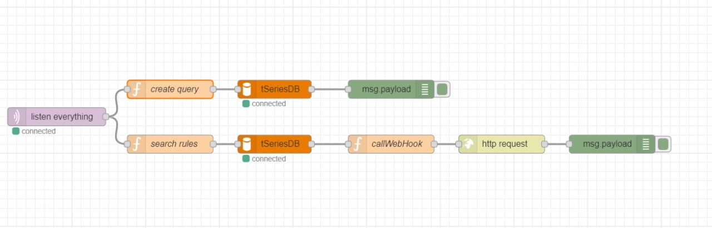

# Build Your Own IoT Platform 
## Rule Engine and Authentication
### Actividad Calificada 3
- Tacca Gutierrez, Jesus
- Quispe Menor, Hermogenes
## Herramientas
- Docker
- Mosquitto
- MariaDB - phpMyAdmin
- Node-RED

## Build
```bash
docker-compose up
```
- Importar el archivo JSON con el flow Node-RED

### Creating a Database
Para crear un motor de reglas basado en consultas es definir el esquema de datos y agregar una tabla de datos en nuestro almacenamiento de datos de series de tiempo.
- Tabla de datos del rule engine<br/>
&nbsp;

### Building the Flow Sequence

- Secuencia de flujo del motor de reglas en combinación con el data listener<br/>
&nbsp;

Se conecto el primer bloque de funciones, las reglas de búsqueda, al oyente MQTT, cada vez que hay un mensaje nuevo en la secuencia, este bloque buscará las reglas correspondientes y el nodo MySQL ayuda a obtener esas reglas de la tabla de datos ruleEngine.

- HTTP request node configuration<br/>
&nbsp;

El nodo de solicitud HTTP ejecutará una llamada HTTP y devolverá la salida como un objeto JSON analizado, que simplemente enviamos a la salida de depuración.

- Debug del flow en funcionamiento<br/>
&nbsp;

